# Sơ đồ quy trình nghiệp vụ Event Ticket Booking System

Tài liệu này tổng hợp các biểu đồ Activity và Sequence cho các quy trình chính của hệ thống, dựa trên các controller/service hiện có trong dự án.

## 1. Quy trình đặt vé

### Activity Diagram
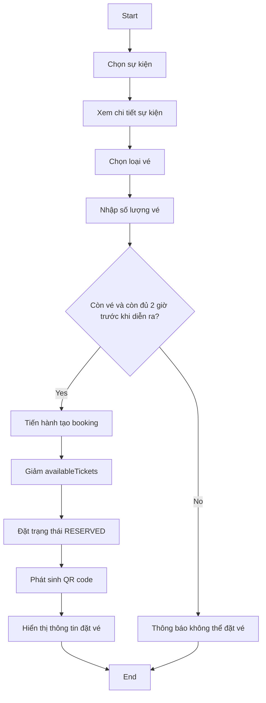

### Sequence Diagram
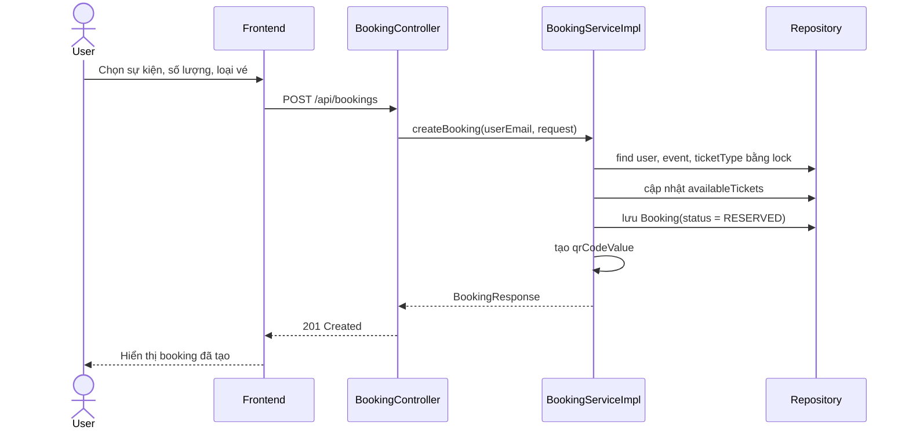

## 2. Quy trình thanh toán qua VNPay

### Activity Diagram
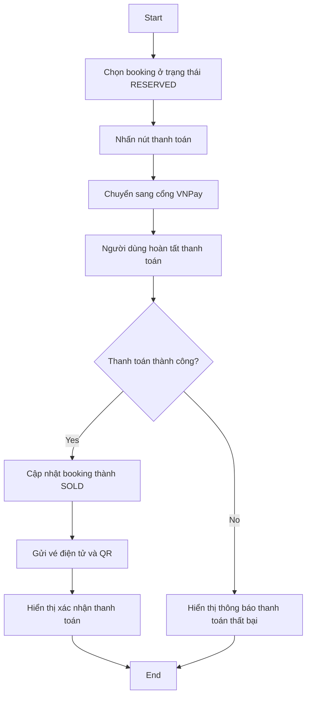

### Sequence Diagram
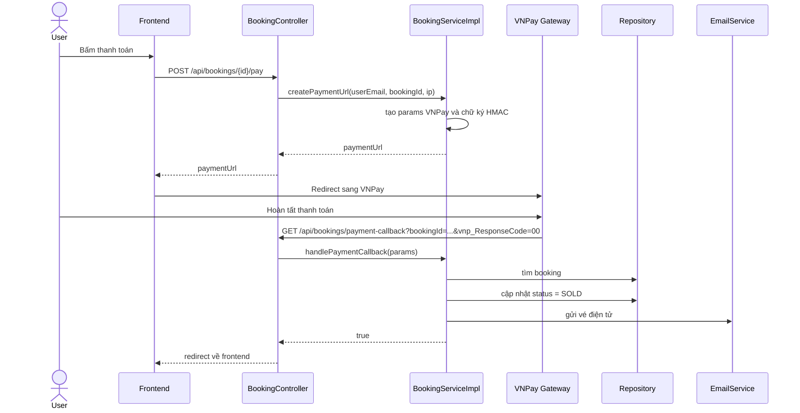

## 3. Quy trình hoàn vé

### Activity Diagram
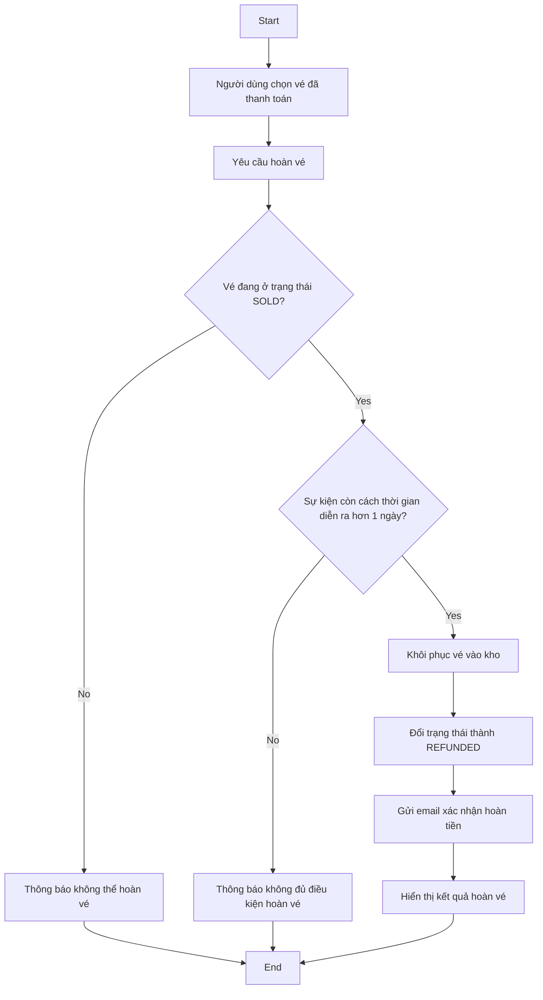

### Sequence Diagram
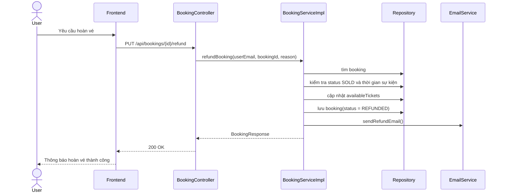

## 4. Quy trình check-in QR

### Activity Diagram
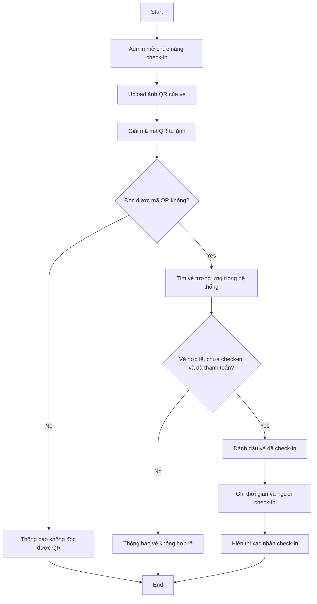

### Sequence Diagram
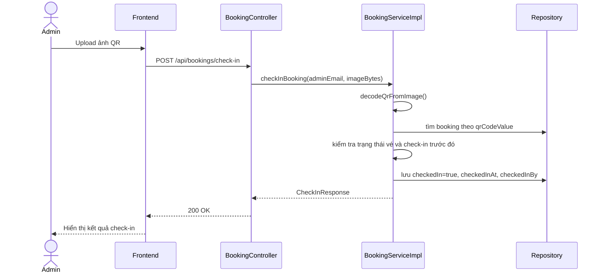

## 5. Quy trình ChatBot AI

### Activity Diagram
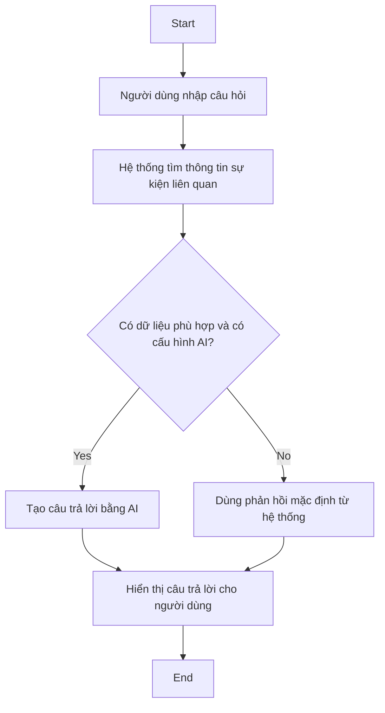

### Sequence Diagram
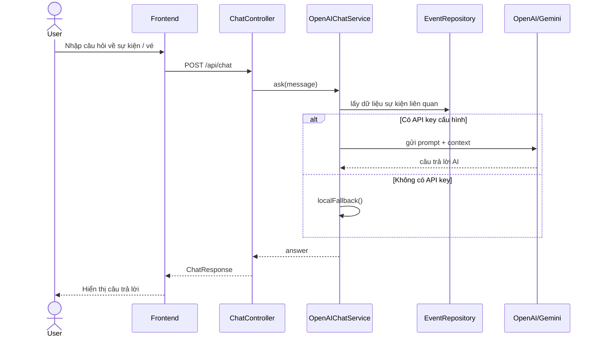

## 6. Quy trình tự động giải phóng vé

### Activity Diagram
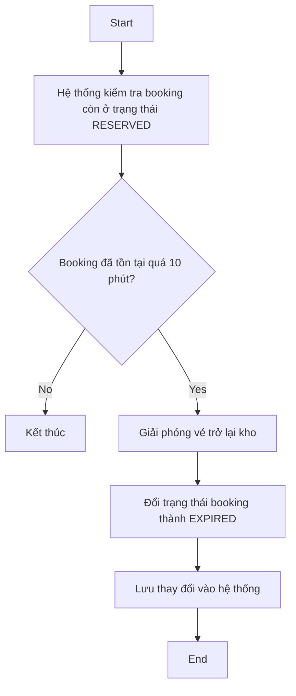

### Sequence Diagram
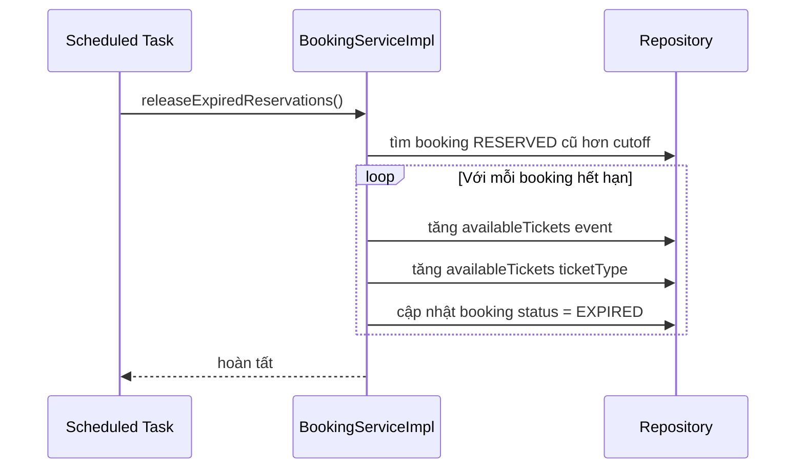

## 7. Biểu đồ kiến trúc tổng thể hệ thống

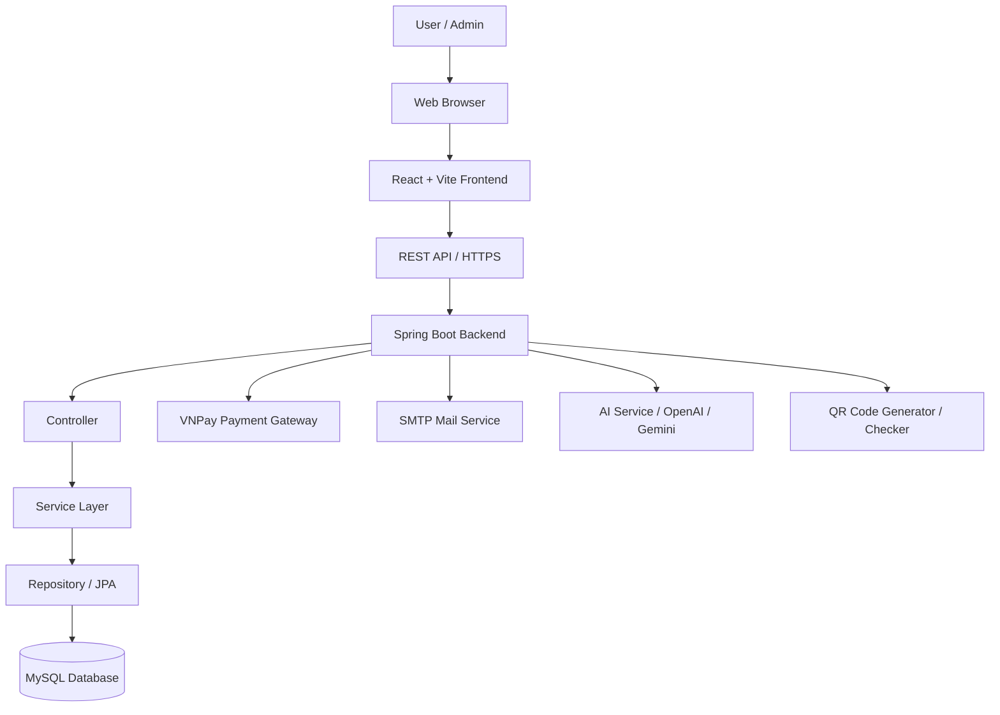

### Mô tả kiến trúc
- Frontend: React + Vite, giao diện người dùng cho xem sự kiện, đặt vé, thanh toán và quản lý vé.
- Backend: Spring Boot xử lý nghiệp vụ chính như đặt vé, thanh toán, hoàn vé, check-in QR và chatbot AI.
- Data layer: Spring Data JPA kết nối với MySQL để lưu sự kiện, booking, user, ticket type và trạng thái vé.
- Tích hợp bên ngoài:
  - VNPay: thanh toán tiền vé.
  - SMTP Mail: gửi vé điện tử và email hoàn tiền.
  - AI Service: chatbot hỗ trợ người dùng hỏi về sự kiện và vé.

## 8. Biểu đồ class UML

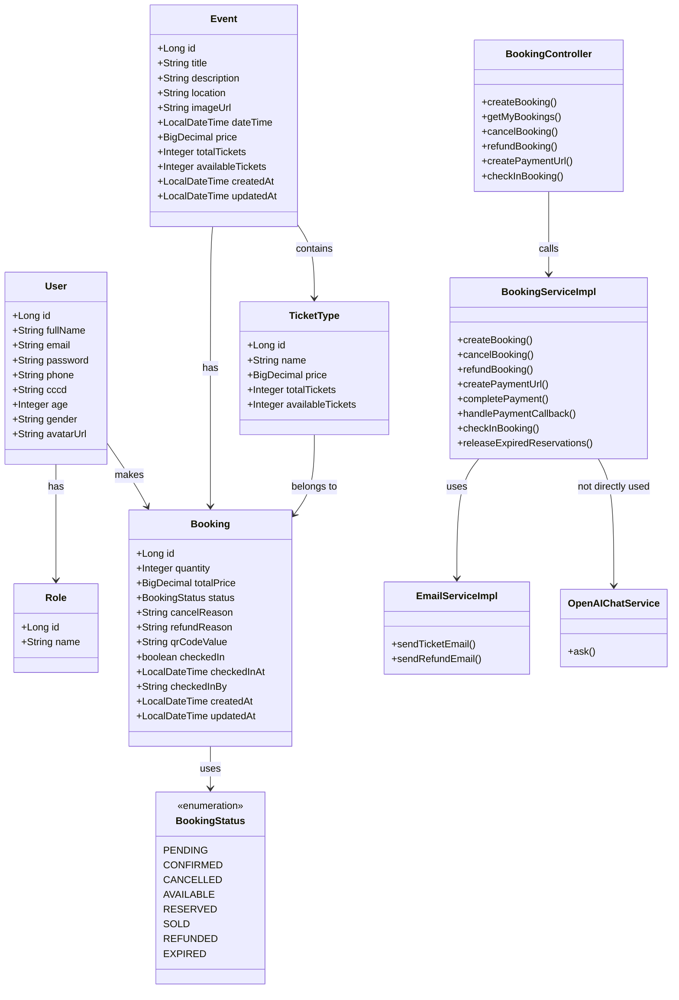

### Nhận xét về class diagram
- User và Role là lớp người dùng và vai trò phân quyền.
- Event và TicketType mô hình hóa sự kiện và các loại vé khác nhau.
- Booking là lớp trung tâm để quản lý trạng thái đặt vé, thanh toán và check-in.
- BookingServiceImpl là lớp xử lý nghiệp vụ chính cho các quy trình đặt vé, hoàn vé, thanh toán và QR.

## 9. Biểu đồ Package Diagram

```mermaid
flowchart TB
    subgraph ControllerLayer[controller]
        C1[AuthController]
        C2[EventController]
        C3[BookingController]
        C4[UserController]
        C5[AdminController]
        C6[ChatController]
    end

    subgraph ServiceLayer[service]
        S1[AuthService]
        S2[EventService]
        S3[BookingService]
        S4[UserService]
        S5[AdminStatsService]
        S6[EmailService]
        S7[OpenAIChatService]
    end

    subgraph RepositoryLayer[repository]
        R1[UserRepository]
        R2[EventRepository]
        R3[BookingRepository]
        R4[TicketTypeRepository]
        R5[RoleRepository]
    end

    subgraph ModelLayer[entity + dto]
        E1[entity]
        D1[dto]
    end

    subgraph SupportLayer[config / security / scheduler / exception / util]
        X1[config]
        X2[security]
        X3[scheduler]
        X4[exception]
        X5[util]
    end

    subgraph DataLayer[Database]
        DB[(MySQL Database)]
    end

    C1 --> S1
    C2 --> S2
    C3 --> S3
    C4 --> S4
    C5 --> S5
    C6 --> S7

    S1 --> R1
    S2 --> R2
    S3 --> R3
    S3 --> R4
    S4 --> R1
    S5 --> R3
    S7 --> R2

    S3 --> S6

    S1 --> E1
    S2 --> E1
    S3 --> E1
    S4 --> D1
    S5 --> D1

    C1 --> X2
    C3 --> X2
    C5 --> X2
    S1 --> X1
    S3 --> X3
    S3 --> X4
    S7 --> X5

    R1 --> DB
    R2 --> DB
    R3 --> DB
    R4 --> DB
    R5 --> DB
```

### Mô tả package diagram
- Package controller chứa các controller xử lý request từ frontend.
- Package service chứa logic nghiệp vụ chính như auth, event, booking, payment, refund và chatbot.
- Package repository là lớp truy cập dữ liệu với Spring Data JPA.
- Package entity và dto mô tả dữ liệu hệ thống và các object truyền giữa tầng.
- Package config, security, scheduler, exception, util là các thành phần hỗ trợ xuyên suốt hệ thống.

## 10. Mô hình kết nối Frontend và Backend

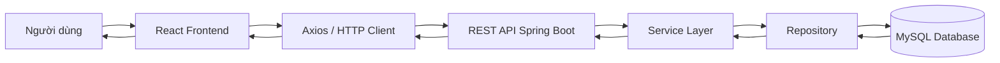

### Mô tả
- Người dùng tương tác với giao diện React trên frontend.
- Frontend sử dụng Axios để gửi các request HTTP đến REST API của Spring Boot.
- Backend xử lý nghiệp vụ ở tầng Service, truy vấn dữ liệu thông qua Repository và lưu trữ trong MySQL.
- Kết quả được trả ngược lại theo đúng chiều ngược của request.

## Ghi chú
- Đây là các luồng nghiệp vụ phù hợp với mã nguồn hiện tại của backend.
- Các trạng thái booking chính: RESERVED, SOLD, CANCELLED, EXPIRED, REFUNDED.
- QR code được sinh khi booking được tạo và dùng cho quy trình check-in.
